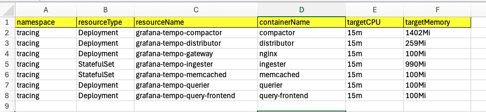

# readme

Contains Go scripts for programmatically deploying [K8s VPAs](https://github.com/kubernetes/autoscaler/tree/master/vertical-pod-autoscaler) 
for every deployment/statefulset/daemonset resource in the
cluster and then extracting the recommendations from each into a CSV format. Designed to be used as part of a pod
rightsizing exercise whilst taking some of the toil away.

Scripts:

- `/manage-vpas`: deploys a VPA for every deployment/statefulset/daemonset resource. Skips if a VPA already exists for that resource
- `/get-recommendations`: queries every VPA in the cluster and outputs the uncapped CPU/memory recommendations as a CSV file

### How to run 

```shell
# Create VPAs
kubectx <k8s-context>
cd ./manage-vpas
go run ./manage-vpas.go [--namespaces=<comma-separated-list>]
```

```shell
# Get recommendations from existing VPAs and output a CSV (results.csv)
kubectx <k8s-context>
cd ./get-recommendations
go run ./get-recommendations.go [--namespaces=<comma-separated-list>]
```

### Example CSV output:

