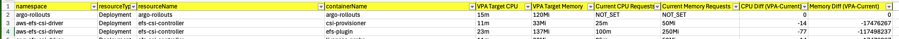

# readme

Contains Go scripts for programmatically deploying [K8s VPAs](https://github.com/kubernetes/autoscaler/tree/master/vertical-pod-autoscaler) 
for every deployment/statefulset/daemonset resource in the
cluster and then extracting the recommendations from each into a CSV format. Designed to be used as part of a pod
rightsizing exercise whilst taking some of the toil away from committing all the VPA config to git.

As part of the export it also includes the current container K8s resource requests for CPU/memory and calculates a diff from the
VPA recommendation, to allow us to see over/under provisioned workloads. Additionally, it checks if the resource already
has an HPA configured. This is to see if it's eligible for the resource being switched to "auto" VPA mode (doesn't work alongside HPA's). 

If a particular resource is managed by another resource (has an owner reference) then the parent resource is targeted by the VPA
instead. It is a requirement of VPA to only target the parent controller. An example is when a `Prometheus` CR manages
a Statefulset which runs the actual pods. In this case the VPA needs to target the CR.

Scripts:

- `/manage-vpas`: deploys a VPA for every deployment/statefulset/daemonset resource. Skips if a VPA already exists for that resource
- `/get-recommendations`: queries every VPA in the cluster and outputs the uncapped CPU/memory recommendations as a CSV file

### How to run 

```shell
# Create VPAs
kubectx <k8s-context>
cd ./manage-vpas
go run ./manage-vpas.go [--namespaces=<comma-separated-list>]
```

```shell
# Get recommendations from existing VPAs and output a CSV (results.csv)
kubectx <k8s-context>
cd ./get-recommendations
go run ./get-recommendations.go [--namespaces=<comma-separated-list>]
```

### Example CSV output:



### Cleanup

All VPAs have a specific label and so can be cleaned up using the CLI:
```shell
kubectl delete vpa -A -l managed-by=vpa-recommendations-script
```